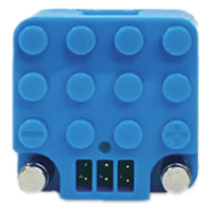

# Circuit Cubes

Circuit Cubes is a Bluetooth LE motor controller cube that drives up to three motors.

## Channels

The device exposes 3 channels:

| Channels | Purpose | Output |
|---|---|---|
| A - C | Motors | -100 % to +100 % |

## Getting started

1. Power on the Circuit Cubes Bluetooth cube.
2. Open the device list and scan for devices.
3. Select the Circuit Cubes device from the scan results to add it.
4. Use the device in a creation: assign its channels to controller actions.

## Notes

- The device does not connect automatically on first use. Connect it from the device page or by starting a creation that uses it.
- The battery voltage is reported by the device and shown on the device page.
- Output values are sent repeatedly for a short time after each change to make sure the cube receives them.

## See also

- [Devices](../../pages/device-list/README.md)
- [Controller action](../../pages/controller-action/README.md)
