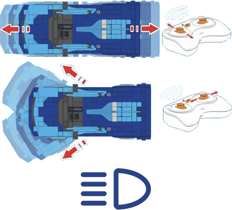

# CaDA Race Car

CaDA Race Car is a Bluetooth LE controlled RC car. The app controls it by sending Bluetooth LE advertising messages, so no classic connection is established.

## Channels

The device exposes 4 channels:

| Channels | Purpose | Output |
|---|---|---|
| 1 | Throttle | -100 % to +100 % |
| 2 | Steering | -100 % to +100 % |
| 3 | Front lights | Off / On |
| 4 | Rear lights | Off / On |

The light channels switch on when the output exceeds 50 % in either direction.

## Getting started

1. Power on the car.
2. Open the device list and press **Scan for new devices**. Found devices are added to the list.
3. Use the device in a creation: assign its channels to controller actions.

## See also

- [Devices](../../pages/device-list/README.md)
- [Controller action](../../pages/controller-action/README.md)
