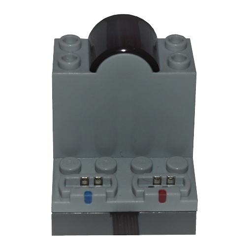

# LEGO Power Functions Infrared

The infrared device controls LEGO Power Functions receivers through the phone's infrared emitter.

> **Note:** Infrared devices are supported on Android only, and only on phones with an infrared emitter. They cannot be found by scanning and must be added manually.

## Channels

The device exposes 2 channels:

| Channels | Purpose | Output |
|---|---|---|
| 1 - 2 | Receiver outputs (Blue, Red) | -100 % to +100 % |

## Getting started

1. Make sure the phone has an infrared emitter and the receiver is switched on.
2. Open the device list and press **Manually add devices**, then select the infrared device and apply the changes.
3. Use the device in a creation: assign its channels to controller actions.

## See also

- [Devices](../../pages/device-list/README.md)
- [Controller action](../../pages/controller-action/README.md)
