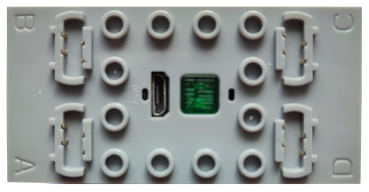

# MK 4.0

MK 4.0 is a Mould King Bluetooth LE module that drives up to four motors. Up to three modules can be controlled at the same time.

## Channels

Each module exposes 4 channels:

| Channels | Purpose | Output |
|---|---|---|
| 0 - 3 | Motors | -100 % to +100 % |

## Getting started

1. Power on the MK 4.0 module.
2. Open the device list and add the device manually. The module is not discovered by scanning.
3. In the manual device list, switch on **MK 4.0 Device 1**. Use **Device 2** and **Device 3** for additional modules.
4. Use the device in a creation: assign its channels to controller actions.

## Notes

- Up to three MK 4.0 modules are supported. All of them share one Bluetooth advertising stream.
- Output is sent as Bluetooth advertising, so the module does not report a connection state or battery voltage.
- The connect telegram is sent again after all channels have stayed at zero for a few seconds.

## See also

- [Devices](../../pages/device-list/README.md)
- [Controller action](../../pages/controller-action/README.md)
