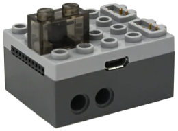

# PFx Brick

PFx Brick (FX Bricks) is a Bluetooth LE brick that drives Power Functions motors and lights, and plays sounds.

## Channels

The device exposes 10 channels:

| Channels | Purpose | Output |
|---|---|---|
| A - B | Power Functions motors | -100 % to +100 % |
| 1 - 8 | Lights | brightness 0 to 100 % |

## Getting started

1. Power on the PFx Brick.
2. Open the device list and scan for devices.
3. Select the PFx Brick from the scan results to add it.
4. Use the device in a creation: assign its channels to controller actions.

## Sound

Sound is controlled by macros that can be assigned to controller actions:

- **Play sound** starts a sound file stored on the device.
- **Stop sound** stops a playing sound file.
- **Toggle sound** starts the sound, or stops it if already playing.
- **Set volume** sets the volume to a chosen level.
- **Increase volume** and **Decrease volume** change the volume by a step.

## Scripts

Script macros can be assigned to controller actions:

- **Run script** starts a script stored on the device.
- **Stop script** stops a running script.

## Settings

- **Default volume level**: the volume applied after connecting. The default is 50 %.

## Notes

- The device does not connect automatically on first use. Connect it from the device page or by starting a creation that uses it.
- Sound files and scripts must be present on the PFx Brick; the app only triggers them.
- Sound files and scripts are managed by the PFx Brick app, not by this app.

## See also

- [FX Bricks documentation](https://shop.fxbricks.com/pages/documentation)
- [Controller action](../../pages/controller-action/README.md)
