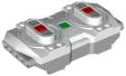

# LEGO Powered Up Remote Control

LEGO Powered Up Remote Control (88010) is a Bluetooth LE remote. It has no outputs. Instead, it works as an input device, and its buttons can be assigned to controller actions.

## Buttons

| Button | Description |
|---|---|
| A, B | Center buttons of the left (A) and right (B) side |
| A.Plus, A.Minus | Plus and minus of the left side |
| B.Plus, B.Minus | Plus and minus of the right side |
| Home | Green button |

## Getting started

1. Power on the remote by pressing its green button.
2. Open the device list and press **Scan for new devices**. Found devices are added to the list.
3. Open the device page and enable the remote control. It is disabled by default.
4. Assign its buttons to controller actions.

## Notes

- The device has no channels, so it cannot be used as an output in a creation.

## See also

- [Devices](../../pages/device-list/README.md)
- [Controller action](../../pages/controller-action/README.md)
