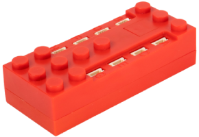

# SBrick Light

SBrick Light is a Bluetooth LE controller for LED lights with up to eight light ports.

## Channels

The device has 8 ports (A - H), each with an RGB light. Each port can be controlled in one of two ways:

- **RGB** - define the RGB color of the port in the settings; the channel then controls its brightness (8 channels, one per port).
- **Micro channels** - control the red, green and blue components of the port separately (3 micro channels per port, 24 in total).

| Mode | Channels | Purpose | Output |
|---|---|---|---|
| RGB | 1-8 (one per port A - H) | Brightness of the color defined for the port. | 0 % to 100 % |
| Micro channels | 24 (R, G, B of each port) | Brightness of each color component. | 0 % to 100 % |

## Getting started

1. Power on the SBrick Light.
2. Open the device list and press **Scan for new devices**. Found devices are added to the list.
3. Use the device in a creation: assign its channels to controller actions.

## Settings

Under **Channel colors** in device settings, choose the color for each port (A - H). RGB mode uses that color, and the default is white.

## See also

- [Devices](../../pages/device-list/README.md)
- [Controller action](../../pages/controller-action/README.md)
