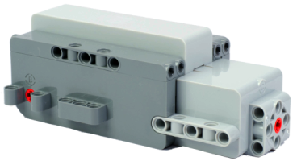

# LEGO Technic Move Hub

LEGO Technic Move Hub is a Bluetooth LE hub with three motor ports (A, B, C) and six light outputs.

## Channels

The device exposes 9 channels:

| Channels | Purpose | Output |
|---|---|---|
| 1 - 2 | Ports A, B | -100 % to +100 % |
| 3 | Port C (motor or steering servo) | -100 % to +100 % |
| 4 - 9 | Lights 1 - 6 | 0 % to 100 % |

## Getting started

1. Power on the hub.
2. Open the device list and press **Scan for new devices**. Found devices are added to the list.
3. Use the device in a creation: assign its channels to controller actions.

## PLAYVM mode

When enabled, port C works as a steering servo. Virtual channel **AB** drives ports A and B together as drive motors. When disabled, port C works as a normal motor.

 ## Settings
 - **PLAYVM mode**: Enables PLAYVM behavior. The default is enabled.

## See also

- [Devices](../../pages/device-list/README.md)
- [Controller action](../../pages/controller-action/README.md)
