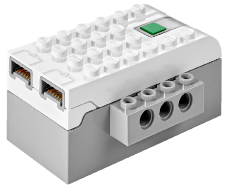

# LEGO WeDo 2.0 Smart Hub

LEGO WeDo 2.0 Smart Hub is a Bluetooth LE hub with two ports for motors.

## Channels

The device exposes 2 channels:

| Channels | Purpose | Output |
|---|---|---|
| 1 - 2 | Ports A, B | -100 % to +100 % |

## Getting started

1. Power on the hub by pressing its button.
2. Open the device list and press **Scan for new devices**. Found devices are added to the list.
3. Use the device in a creation: assign its channels to controller actions.

## See also

- [Devices](../../pages/device-list/README.md)
- [Controller action](../../pages/controller-action/README.md)
